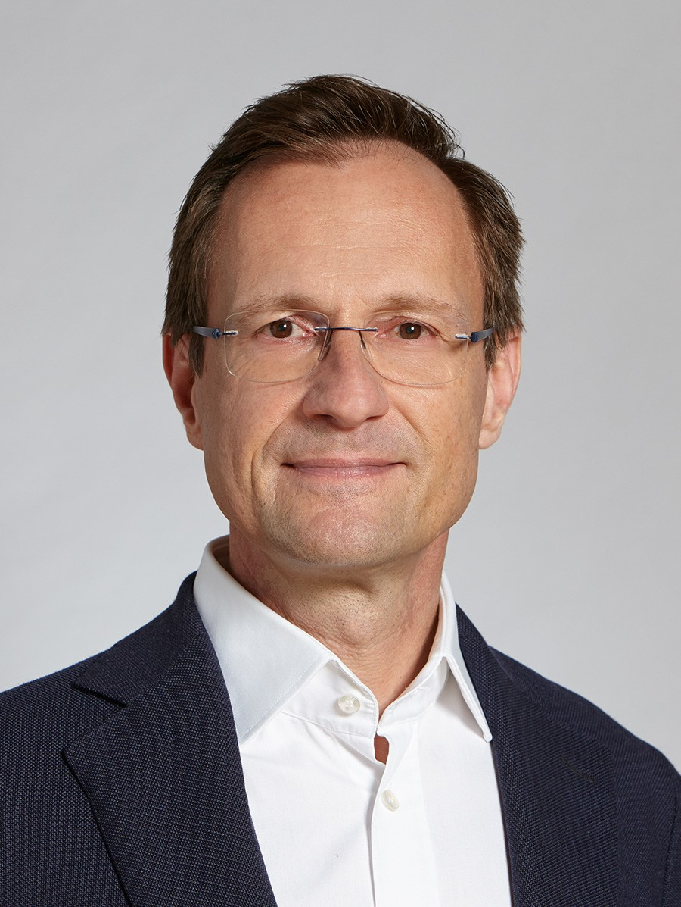

# 1st ACM SIGSPATIAL International Workshop on Reproducibility in tracking data analysis and mobility research

Co-located with SIGSPATIAL' 23, November 13th (Monday) 2023, Hamburg, Germany

{% include figure.html img="teaser.jpg" alt="intro image" width="100%" %}

## Background and workshop goals

In 2015, a study estimated the rate of replicability of psychology studies published in top journals at about 40%, sending shock-waves through the community and starting what is called the replicability crises in psychology. Since then, subsequent studies showed that the problem of reproducible research is not limited to Psychology, but poses a systematic problem in all scientific disciplines. Very recently, researchers discussed the challenges of reproducibility in geoinformation science and spatial sciences and how to address them in practice. However, these best-practices are not yet adopted in all fields within GIScience.

Reproducibility is especially challenging in mobility analysis, a core area of research presented at ACM SIGSPATIAL. Our understanding of how people travel was greatly enhanced over the last years based on large-scale movement data such as call-detail record (CDR), check-in sequences from location-based social networks (LBSN) and GNSS tracking data sets. However, real-world data is often plagued by inaccuracies, such as GNSS noise, false labeling and limited tracking coverage, all of which require extensive preprocessing efforts. 
Preprocessing in movement data analysis is still not standardized and the processing steps and their outcomes are, therefore, often different across studies. Problematically, the results of studies based on mobility data strongly depend on the employed preprocessing methods. Thus, the variety of preprocessing methods hinders the comparability of research results in movement data analysis. They are also not documented comprehensively and prominently in many studies, limiting the reproducibility of mobility studies.

We aim to bring the community together in a workshop on reproducibility in tracking data analysis and mobility research to discuss and advance reproducibility and transparency in movement data analysis. The workshop will comprise an keynote talk, an interactive tutorial on standardizing tracking data analysis and a discussion section on necessary future efforts to improve the comparability of mobility research.

## Keynote speaker

Prof. [Edzer Pebesma](https://www.uni-muenster.de/Geoinformatics/en/institute/staff/index.php/119/edzer_pebesma) (Director of the Institute for Geoinformatics, University of Münster)

**Title**: Reproducibility in Tracking Data Analysis

**Abstract**: In this talk I will discuss of reproducibility in general, why it matters for good science, the differences to replicability, and the challenging aspects to reproducing scientific computations.  I will also discuss the practice of how we conduct science, how and why we write, submit and review research papers, how and why we write, share and publish research software, and the connection between these two. Although not an expert in the area of tracking data analysis, I will try to shed some light on particular challenges for reproducibility of tracking data analysis, and try to formulate some recommendations.

## Program

* Keynote on Reproducibility in Spatial Data Science
* Hands-on section: tracking data processing tutorials and interactive section
* Discussion on the future of reproducibility in tracking data analysis.

The detailed schedules are as follows:

| Time | Content |  
| :---------------:| :---------------: |
| 8:00 - 8:10  | Welcome by workshop organizers |
| 8:10 - 8:40  | Keynote speech by Prof. Edzer Pebesma (20 + 10 min Q&A) |
| 8:40 - 8:55  | Introduction to the [Geoprivacy platform](https://geoprivacy.fi/#/) by [Ville Mäkinen](https://www.maanmittauslaitos.fi/en/research/contact-information/staff/ville-makinen) (10 + 5 min Q&A)|
| 8:55 - 10:00  | Trackintel introduction and tutorial  |
| 10:00 - 10:30  | Reproducibility interactive section  |
| 10:30 - 11:00  | Coffee break |
| 11:00 - 11:40  | Reproducibility interactive section continued |
| 11:40 - 12:00  | Discussion: future of reproducibility |

## Hands-on tutorial with Trackintel

Our workshop is targeted at researchers working with tracking data interested in new tools for standardized data preprocessing. The second part of the workshop will feature a specific tool developed to improve reproducibility, namely the open-source library [Trackintel](https://github.com/mie-lab/trackintel). Trackintel builds on an established data model for mobility data and aims to align preprocessing methods in a common framework. It is applicable to different types of tracking data and yields high-level representations such as locations, staypoints and trips, which are consistent with movement concepts in GIS and transport planning. The functionality of Trackintel will be shortly presented by the workshop organizers and demonstrated on a standard tracking dataset that is publicly available. Participants will then have the chance to work with their own tracking data. In the hands-on tutorial, participants will be asked to follow the preprocessing steps as well as to apply analysis tools yielding high-level information such as the length of trips, the data quality in terms of temporal tracking coverage, and transport mode split. With the tutorial, participants will gain a basic understanding of the procedures of reproducible mobility analysis and will be able to fairly compare the properties of their data with open-source datasets. 

Check more about the trackintel library here:

 [{{ lesson.title }}]({{ lesson.url | relative_url }})


## Organizers

| [Nina Wiedemann](https://baug.ethz.ch/en/department/people/staff/personen-detail.MjUzNzEy.TGlzdC82NzksLTU1NTc1NDEwMQ==.html) | [Henry Martin](https://n.ethz.ch/~martinhe/) | [Ye Hong](https://hongyeehh.github.io/) | [Martin Raubal](https://www.raubal.ethz.ch/) |
| :---------------:| :---------------: | :---------------: | :---------------: |
|   |   |   |   |

[Mobility Information Engineering Lab, ETH Zürich](http://mie-lab.ethz.ch/)

<!-- Hosted by [University of Idaho Library](http://www.lib.uidaho.edu/), {{ site.pub_year }}. -->

<!-- > images and content: cc-by-sa <a href="https://github.com/{{ site.github_username }}">{{ site.author }}</a> {{ site.pub_year}} (get [source code]({{ site.repo }})).
> Last build date: {{ site.time | date: "%Y-%m-%d" }}.
>
>  -->
